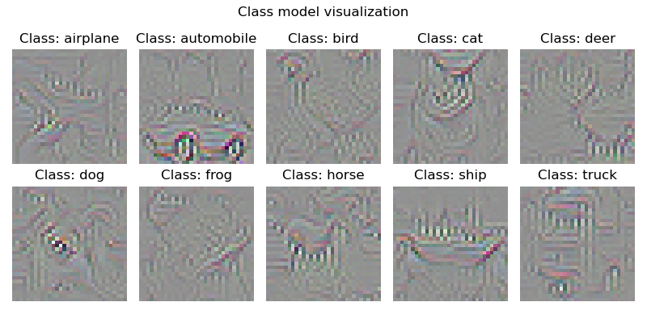
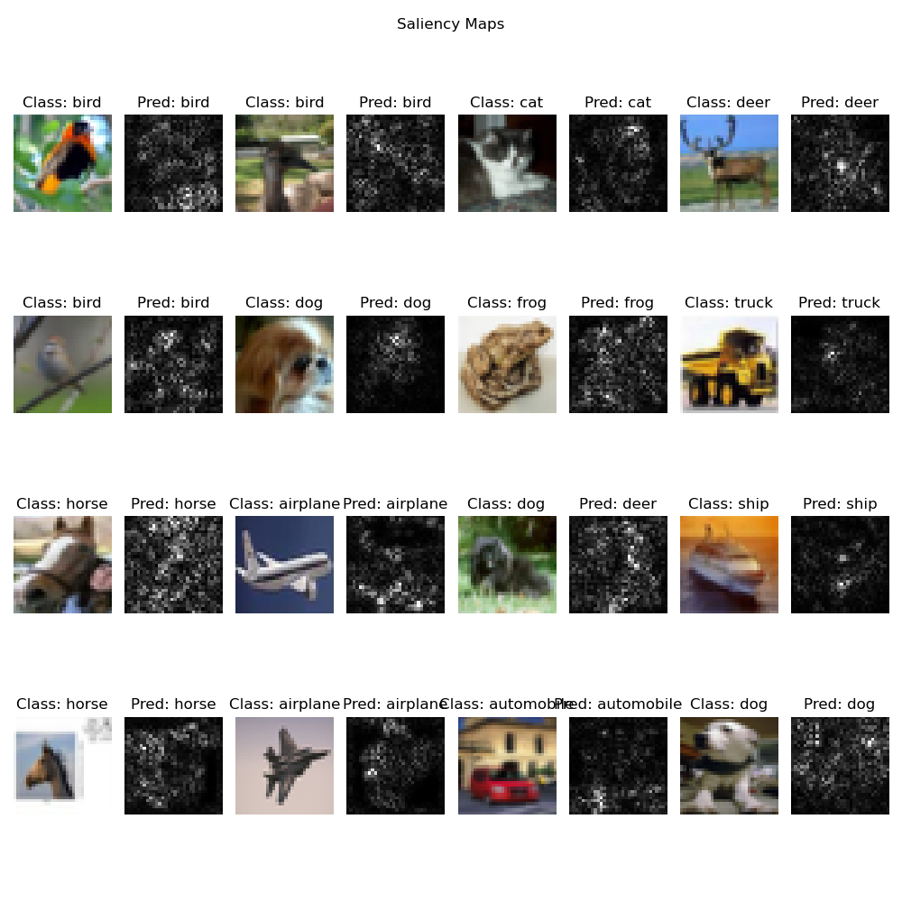

## Description
This repository implements the explainability techniques described in this paper: [Deep Inside Convolutional Networks: Visualising Image Classification Models and Saliency Maps](https://arxiv.org/abs/1312.6034).

## Usage
This repo trains a ConvNet on the CIFAR10 dataset and then applies the visualization techniques of the paper to understand what the ConvNet does.

### Training
To train the model, run:
```bash
python -m src.train
```

### Explainability
To perform the explainability techniques, run:
```bash
python -m src.explain
```


Example output of Class Model Visualization:


Example output of Saliency Map:
